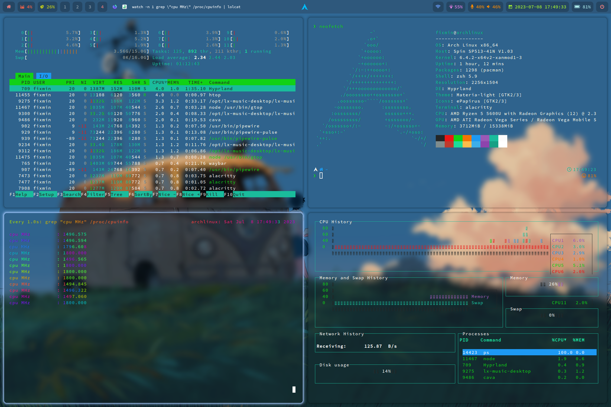
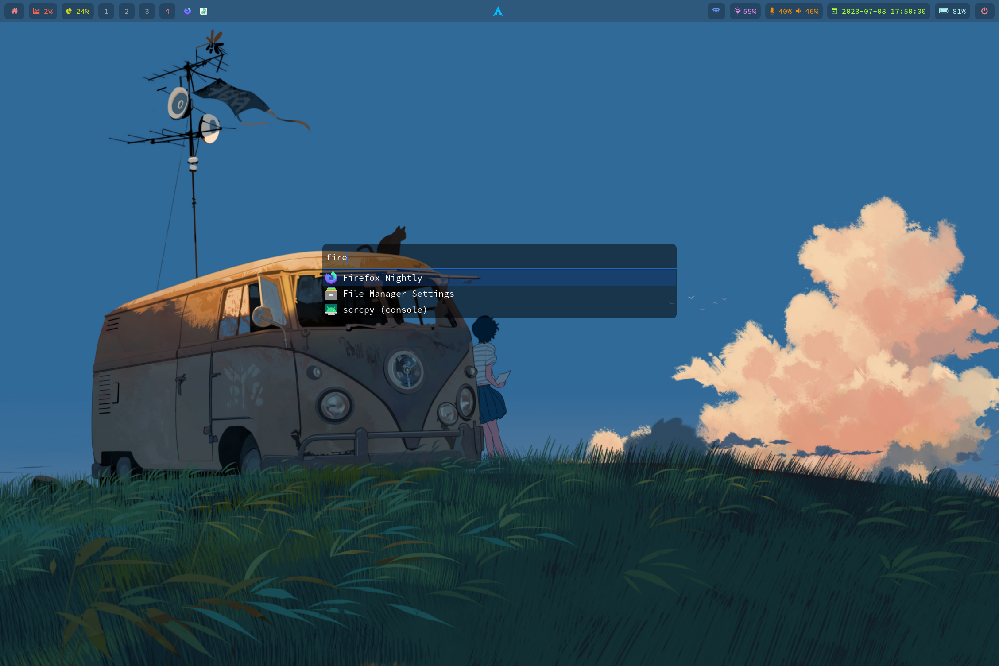
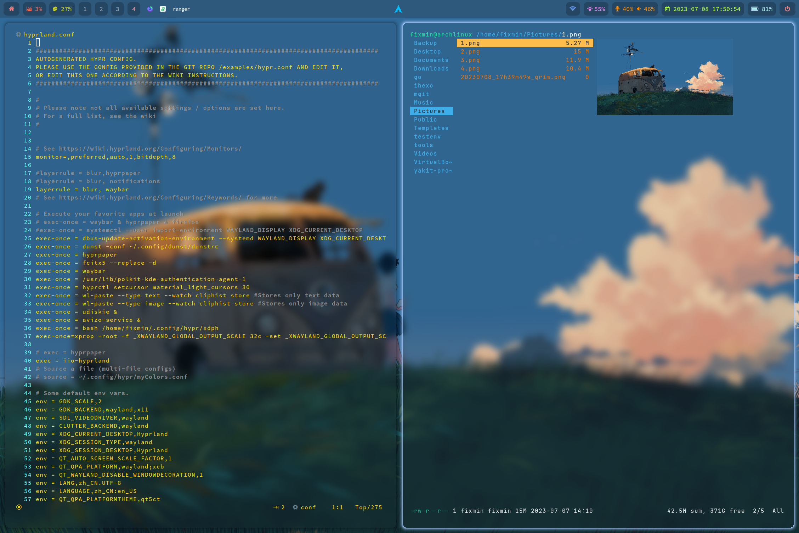
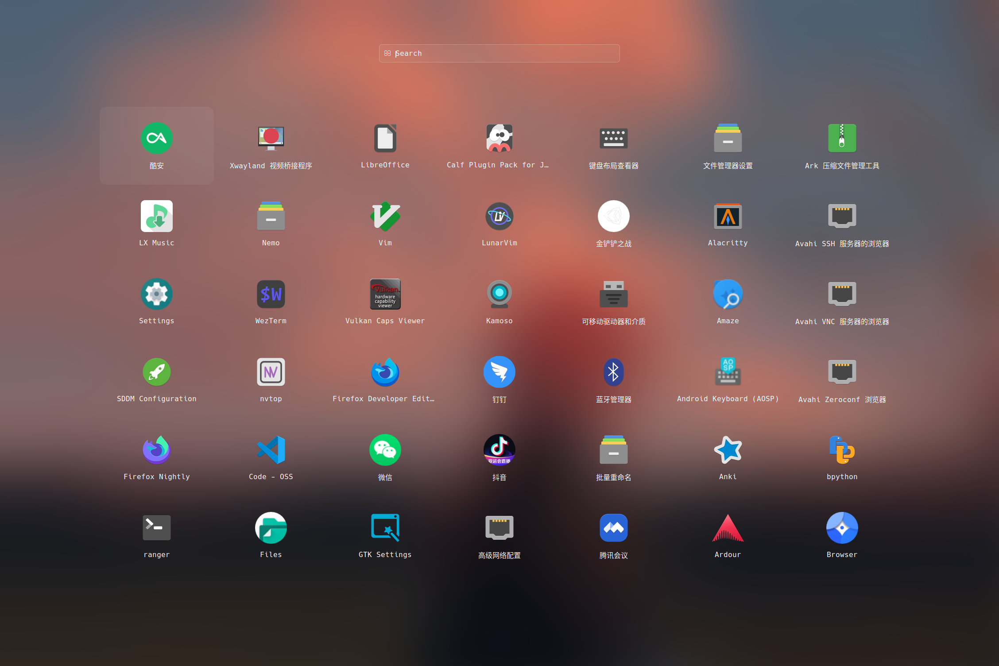
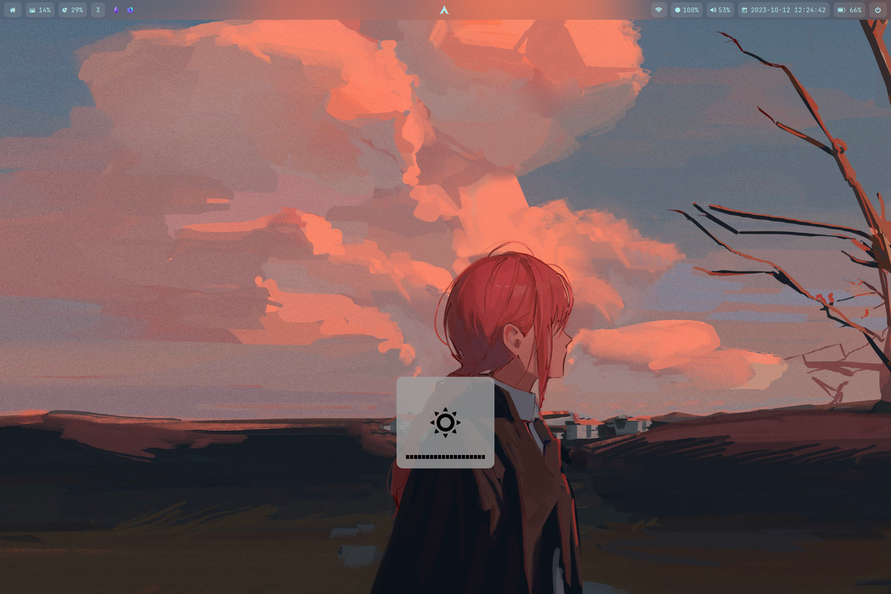
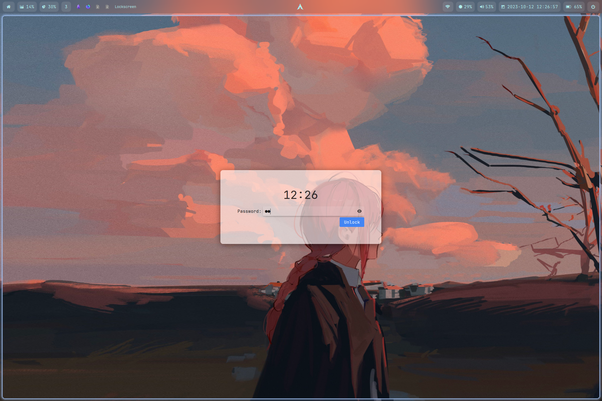

# hyprfiles
hyprland configuration file
# 配置说明

- 终端：Alacritty，Kitty，Wezterm
- 应用启动器：Anyrun，Rofi
- 音量，亮度控制：Avizo （自带了一个修改音量亮度后的通知）
- 通知：Dunst
- 状态栏：Waybar
- 壁纸：Hyprpaper
- 。。。。。。。。。。。。。。。。。。。。。。。。。。。

详细参考配置文件

# 截图

