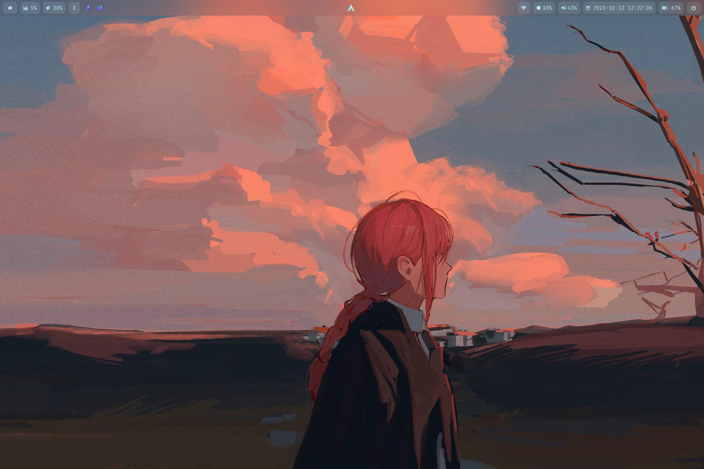

# Hyprland Configuration Files

<div align="center">
  
</div>

This repository contains a collection of configuration files for the Hyprland compositor.

## Table of Contents

- [Features](#features)
- [Installation](#installation)
- [Configuration](#configuration)
- [Screenshots](#screenshots)
- [Contributing](#contributing)
- [License](#license)

## Features

This configuration provides a highly customized and optimized Hyprland setup, featuring:

- **Clean and minimal aesthetics**
- **Efficient workflow and keybindings**
- **Seamless integration with popular applications**

## Installation

1. Clone the repository:

```
git clone https://github.com/0a00/hyprfiles.git ~/.config/hypr
```

2. Install the required dependencies.

3. Copy the configuration files to your `~/.config/hypr` directory.

## Configuration

The configuration files are well-documented and allow for easy customization. You can adjust various aspects of the setup, including:

- **Keybindings**
- **Window management**
- **Appearance**
- **Applications**

## Screenshots

<div align="center">
  
  
  
  
  
  
  
  
  
  
  
  
  
</div>

## Contributing

Contributions are welcome! If you have any suggestions, bug reports, or feature requests, please open an issue or submit a pull request.

## License

This project is licensed under the MIT License.

---

<div align="center">

<a href="https://github.com/0a00/hyprfiles">📂： Hyprland 桌面下一系列配置文件</a>

<a href="https://git.io/typing-svg"></a>

</div>

<div align="center">


<br />

</div>

[](https://star-history.com/#0a00/hyprfiles&Date)
