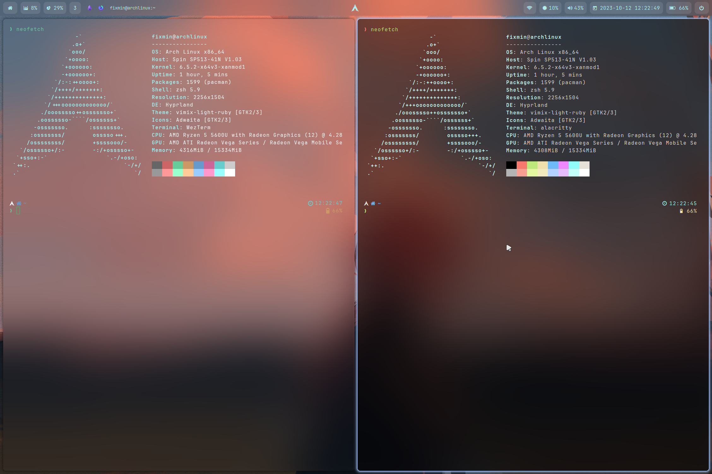

# Hyprland 配置文件

## 简介

本仓库包含 Hyprland 合成器的配置文件集合。

## 特性

-  简洁美观的界面
-  高效的工作流程和快捷键绑定
-  与流行应用程序的无缝集成

## 安装

1. 克隆仓库：

```bash
git clone https://github.com/0a00/hyprfiles.git ~/.config/hypr
```

2. 安装所需依赖项。

3. 将配置文件复制到 `~/.config/hypr` 目录。

## 配置

配置文件有详细的文档记录，可以轻松自定义。 您可以调整设置的各个方面，包括：

-  快捷键
-  窗口管理
-  外观
-  应用程序

## 预览

<div align="center">
  
</div>
<div align="center">
  
</div>
<div align="center">
  
</div>
<div align="center">
  
</div>
<div align="center">
  
</div>
<div align="center">
  
</div>

## 贡献

欢迎贡献！ 如果您有任何建议、错误报告或功能请求，请创建问题或提交拉取请求。

## 许可证

该项目在 MIT 许可证下获得许可。

---

<div align="center">

<a href="https://github.com/0a00/hyprfiles">📂： Hyprland 桌面下一系列配置文件</a>

<a href="https://git.io/typing-svg"></a>


<br />


[](https://star-history.com/#0a00/hyprfiles&Date)

</div>
